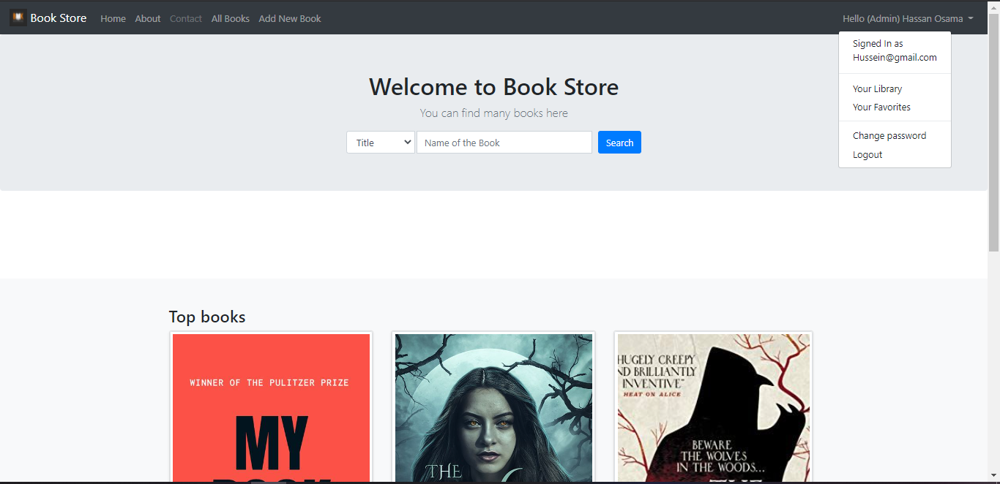
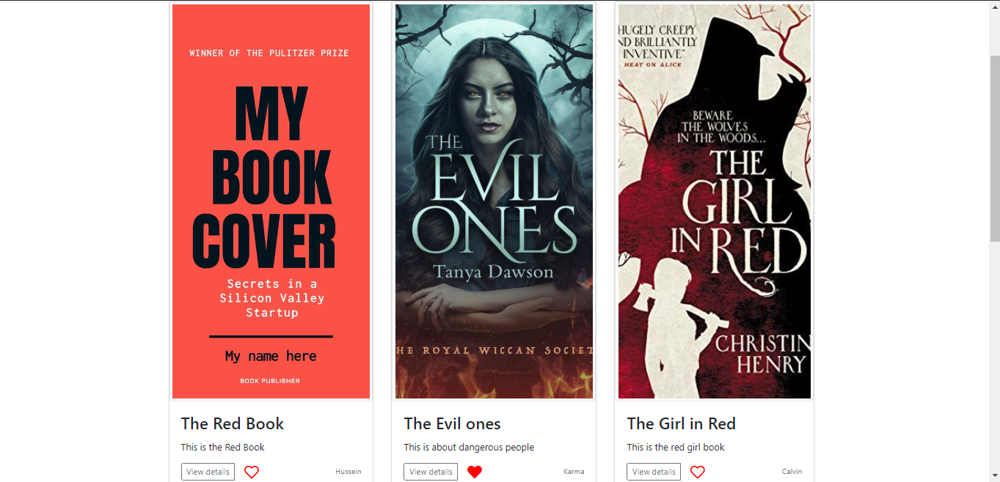
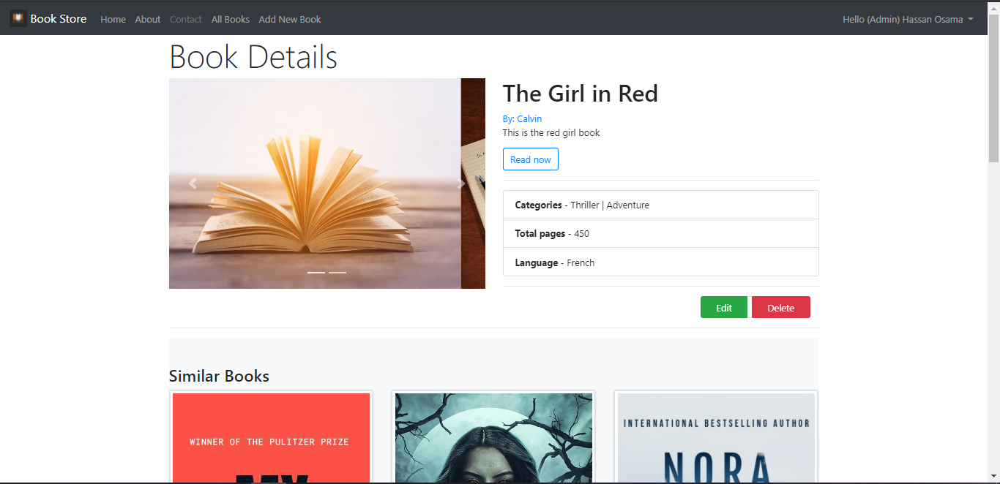
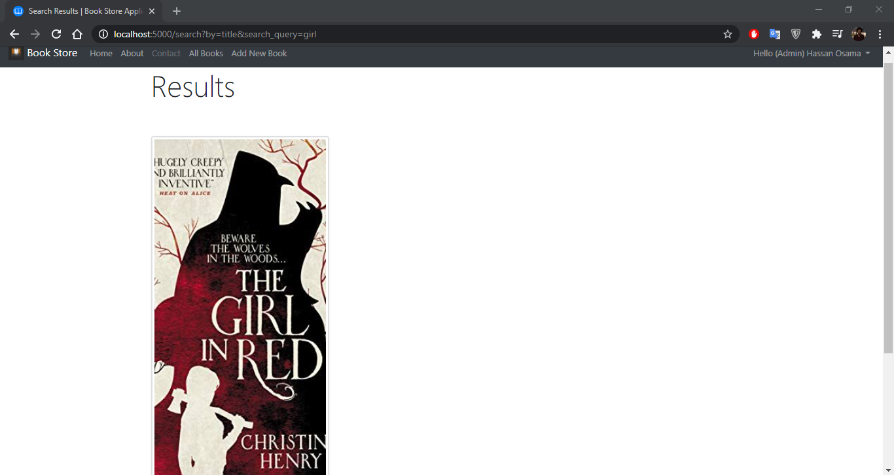
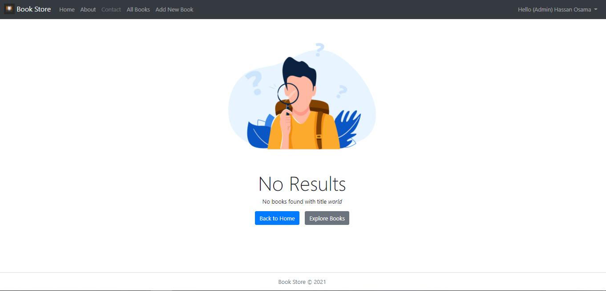
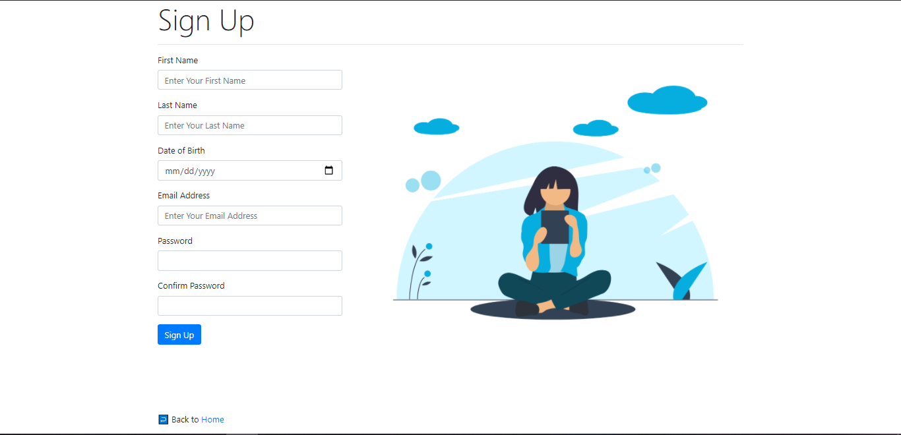
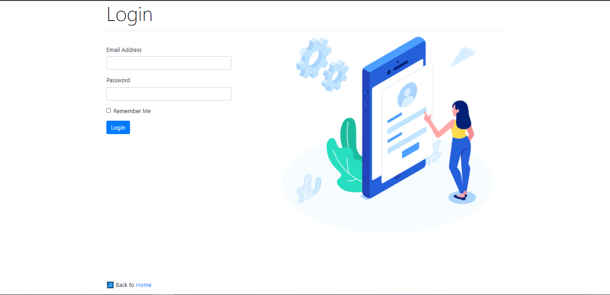

# Book Store Web Application

Book Store is a Web Application to store, view, and manipulate books.

## Functionalities

- View all available books.
- View details of a book.
- Add a new book.
- View top and similar books.
- Search for a book.
- Download book pdf.
- Signup, Login and Logout.
- Change Password
- View your Library.
- Edit and Delete your books.

## Stack

- C#
- ASP.NetCore 3.1
- PostgreSQL
- EntityFramework Core
- Identity
- Html, Css, Javascript, Bootstrap4, and Jquery

## Running the server

From within BookStore.WebApp directory, run:

`dotnet run`

## Overview

### Home

### Books

### Book Details

### Search

### Search (No Results)

### Signup

### Login

## References

- WebGentle youtube [Guide](https://www.youtube.com/playlist?list=PLaFzfwmPR7_LTXu0Vz9Zz_Y0OMMC7ArHZ)

- Microsoft Docs

## Todos

- Add favorite books.
- Some UI magic.
