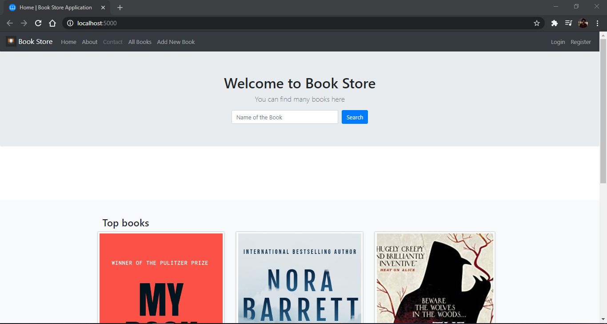
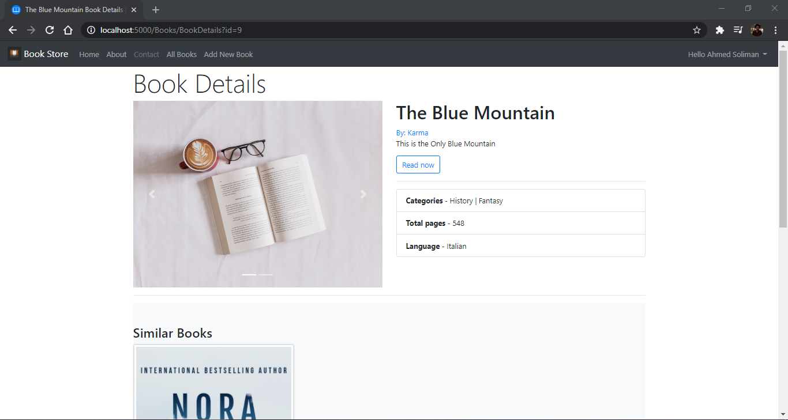
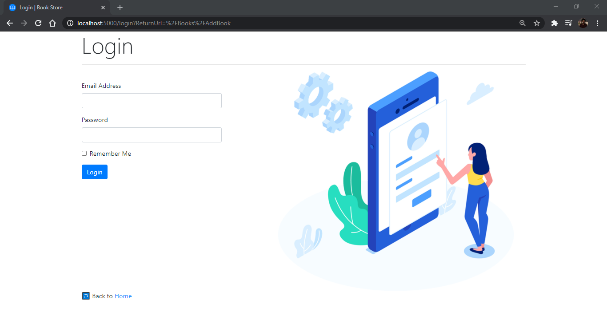

# Book Store Web Application
This is a Web Application to practice DotNet Core.

## Functionalities
* View list of books.
* View details of a book.
* Add a new book.
* View top and similar books.
* Search for a book.
* Download book pdf.
* Signup, Login and Logout.

## Stack
* C#
* Dotnet Core 3.1
* PostgreSQL
* EntityFramework Core
* Identity
* Html, Css, Javascript, Bootstrap4, and Jquery

## Running the server
From within BookStore.WebApp directory, run:

`dotnet run`

## Overview
### Home

### Book Details

### Signup

### Login

## References
* WebGentle youtube [Guide](https://www.youtube.com/playlist?list=PLaFzfwmPR7_LTXu0Vz9Zz_Y0OMMC7ArHZ)

* Microsoft Docs

## Todos
* Add roles.
* Edit and Delete books.
* Add favorite books.